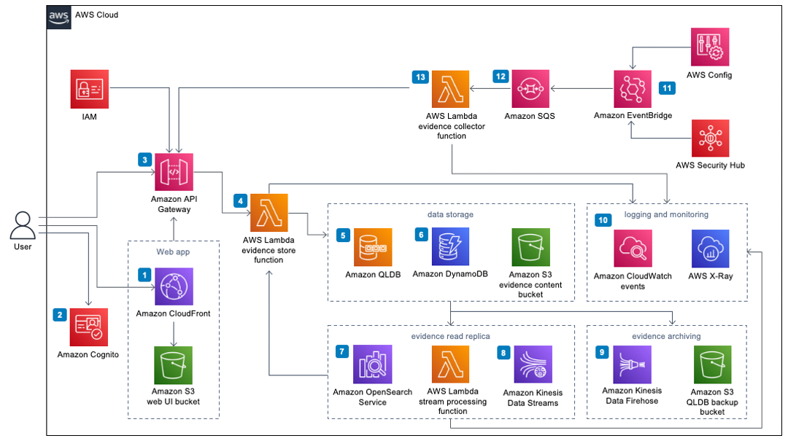

# Verifiable Controls Evidence Store

The Verifiable Controls Evidence Store (Evidence Store) provides a mechanism to centrally store findings and results of cloud security controls governing AWS workloads, in the form of enduring evidence records that are safeguarded against tampering. An evidence record is a system (or human) generated digital record of a historical fact, related to one or more target entities, and is issued by an evidence provider.

The solution comes with a RESTful interface with CRUD APIs, as well as a web interface for managing evidences and evidence providers' resources.

---

## Architecture Overview



1. An Amazon CloudFront distribution to serve the optional UI. CloudFront delivers low latency, high performance, and secure static web hosting. An Amazon Simple Storage Service (Amazon S3) web UI bucket hosts the static web application artifacts.
2. An Amazon Cognito user pool to provide customers a quick and convenient authentication mechanism to explore the solution’s functionalities without extensive configuration.
3. API Gateway to expose a set of RESTful APIs. API Gateway processes HTTP requests issued by the Evidence Store consumers. It orchestrates the authentication and authorization workflows by validating the request’s credentials (signature and API key) against AWS Identity and Access Management (IAM) and its API usage plan.
4. The evidence store Lambda function to process the validated requests from API Gateway. This Lambda function encapsulates the solution's business logic, receiving REST requests from the user via API Gateway, validating them, storing, and retrieving data to and from the various databases.
5. Amazon QLDB to track and store evidence records. QLDB ensures evidence records’ immutability and cryptographically verifiable nature. Evidence records are stored in Amazon S3.
6. Amazon DynamoDB to store evidence providers and their respective evidence content schemas. The request processing Lambda function relies on this data to validate evidence content before committing to its QLDB ledger.
7. A stream processing Lambda function to replicate evidence records to Amazon OpenSearch Service, which offers advanced query capabilities (full text search) across the entire evidence record data structure.
8. Amazon Kinesis Data Streams to replicate records to Amazon OpenSearch Service to offer consumers a better query experience. Amazon Kinesis provides the channels for the solution to replicate and archive evidence records in near real-time.
9. Amazon Kinesis Data Firehose to archive evidence records to an Amazon S3 bucket.
10. AWS CloudWatch and AWS X-Ray for logging and monitoring.
11. AWS Config and AWS Security Hub to publish findings to Amazon EventBridge.
12. Amazon Simple Queue Service (SQS) to provide rate limiting capabilities to AWS Config and the Security Hub Evidence Collector.
13. An evidence collector Lambda function to invoke the create evidence API to record the finding.

## File Structure

Upon successfully cloning the repository into your local development environment, you will see the following file structure in your editor:

```
|- .github/ ...                       - resources for open-source contributions.
|- source/                            - solution's source code
  |- AGSEvidenceStore                 - the evidence store lambda function source code, including unit tests
  |- AGSSecurityHubEvidenceCollector  - the evidence provider that collects findings from AWS Config and AWS Security Hub and stores them as evidences
  |- AGSSharedInfra                   - the common infrastructure including networking construct (vpc, subnets) and cloudfront distribution for the web UI
  |- AGSWebClient                     - the solution web UI.
  |- configurations                   - the solution's configuration files
  |- shared-libs                      - common libraries shared by all solution's components
  |- README.md                        - doc file for the CDK project.
  |- run-all-tests.sh                 - runs all tests within the /source folder
  |- build.js                         - build script
  |- install.js                       - invokes build script and deploy the solution
|- .gitignore
|- CHANGELOG.md                       - required for every solution to include changes based on version to auto-build release notes.
|- CODE_OF_CONDUCT.md                 - standardized open source file for all solutions.
|- CONTRIBUTING.md                    - standardized open source file for all solutions.
|- LICENSE.txt                        - required open source file for all solutions - should contain the Apache 2.0 license.
|- NOTICE.txt                         - required open source file for all solutions - should contain references to all 3rd party libraries.
|- README.md                          - required file for all solutions.
```

---

## Prerequisites

- The latest version of the AWS CLI, installed and configured.
  - https://aws.amazon.com/cli/
- The latest version of the AWS CDK.
  - https://docs.aws.amazon.com/cdk/latest/guide/home.html
- A CDK bootstrapped AWS account.
  - https://docs.aws.amazon.com/cdk/latest/guide/bootstrapping.html
- node.js version 14 or newer.
  - https://docs.npmjs.com/getting-started

---

## Running Unit Tests

The `/source/run-all-tests.sh` script is the centralized script for running all unit, integration, and snapshot tests for both the CDK project as well as any associated Lambda functions or other source code packages.

```
cd source
chmod +x ./run-unit-tests.sh
./run-unit-tests.sh
```

---

## Building and deploying the solution

1. Clone the solution source code from its GitHub repository. `git clone https://github.com/aws-solutions/verifiable-controls-evidence-store`
2. Open the terminal and navigate to the source folder created in step 1. `cd verifiable-controls-evidence-store/source`
3. Set the deployment region `export AWS_REGION=<region-id>`, for a list of supported AWS region, refer to https://docs.aws.amazon.com/solutions/latest/verifiable-controls-evidence-store/design-considerations.html
4. To deploy the solution with its default configuration, run `node install.js`

---

## Configuring the solution

To further customise the solution deployment to suit different use cases, you can modify the `Default.json` file located in `/source/configurations`.

### Data retention policy

By default, all solution data (QLDB ledger, S3 buckets, DynamoDB tables, OpenSearch domain) is removed when you uninstall the solution. To retain this data, in the configuration file, set the `retainData` flag to `true`.

### OpenSearch instance types

To minimise cost, `t3.small.search` is the default OpenSearch instance type. This can be overriden by setting the `openSearchMasterNodeInstanceType` and `openSearchDataNodeInstanceType` values to your instance type of choice. For a list of supported OpenSearch instance types, please visit https://docs.aws.amazon.com/opensearch-service/latest/developerguide/supported-instance-types.html.

### Web UI authentication

In its default configuration, the solution's web interface leverages Amazon Cognito to authenticate users. In addition to this, the solution supports `SAML2` identity federation via AWS SSO. To enable this option, replace the `identityProvider` section in the configuration file with:

```
"identityProvider": {
    "type": "SAML";
    "arn": "the SAML provider's arn";
}
```

---

## Collecting AWS Security Hub and AWS Config findings from other AWS accounts

The provided AWS Security Hub and AWS Config Evidence Collector (source code in `source/SecurityHubEvidenceCollector`) can record and store findings from other AWS accounts as evidences. To enable this feature, deploy the `evidence-collection-setup.yaml` CloudFormation template located in `source/SecurityHubEvidenceCollector/app/deployment-prerequisites` to each of the accounts from which you wish to collect findings. The CloudFormation template should be deployed with the following parameters

- eventBridgeARN: `arn:aws:events:<evidence-store-region>:<evidence-store-account>:event-bus/shec-event-bus`
- lambdaARN: `arn:aws:iam::<evidence-store-account>:role/SecurityHubEvidenceCollectorRole`

This CloudFormation creates a new event bus rule that forwards all findings to the evidence collection event hub in the evidence store account, as well as allowing the security hub evidence collector lambda to retrieve information about the findings' resources such as tags.

---

## Uninstalling the solution

The solution can be uninstalled by deleting the stacks from the AWS CloudFormation console.

- Go to the AWS CloudFormation console, find and delete the following stacks (in the specified order)
  - AGSSecurityHubEvidenceCollector
  - AGSEvidenceStore
  - AGSSharedInfra-WebClient
  - AGSSharedInfra-BaseInfra

---

## Collection of operational metrics

This solution collects anonymous operational metrics to help AWS improve the quality and features of the solution. For more information, including how to disable this capability, see the [implementation guide](https://docs.aws.amazon.com/solutions/latest/verifiable-controls-evidence-store/collection-of-operational-metrics.html).

---

Copyright Amazon.com, Inc. or its affiliates. All Rights Reserved.

Licensed under the Apache License Version 2.0 (the "License"). You may not use this file except in compliance with the License. A copy of the License is located at

    http://www.apache.org/licenses/

or in the "license" file accompanying this file. This file is distributed on an "AS IS" BASIS, WITHOUT WARRANTIES OR CONDITIONS OF ANY KIND, express or implied. See the License for the specific language governing permissions and limitations under the License.
